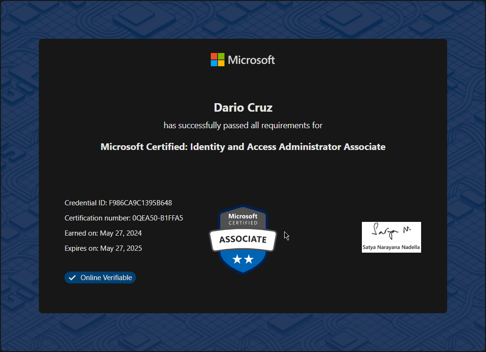
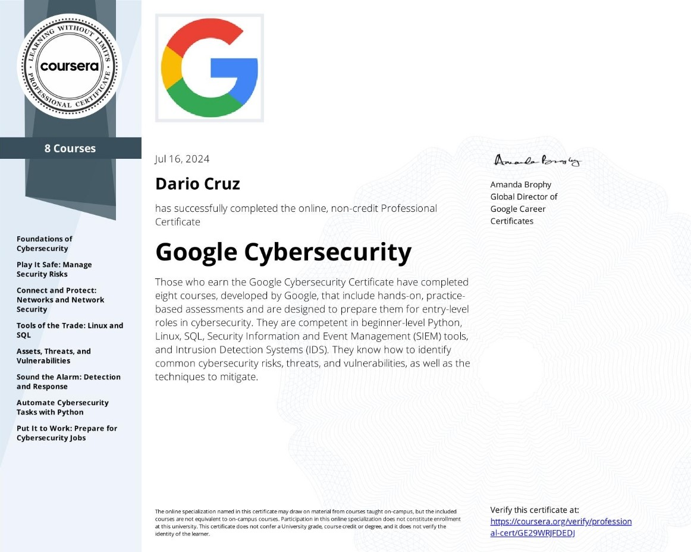

Phew, it's been one hell of a year. At the start of 2024 I made a deal with myself. Progress out of IT Support and take on a new challenge or face the reality that you will be left behind.😅

For me, I know myself to be the type of person to not let talents, skills, and knowledge go to waste. It nags me to no end and will haunt me like a ghost from one of those 80's movies lol.

<!-- truncate -->
So, I sent my targets on pivoting into Cybersecurity. I wanted to go for a certification or training program that could offer me some skills that I could use in my current role and an IT Support Technician. I landed in the SC300 - Identity and Access Administrator certification from Microsoft for a few reasons.
- **I manage and administer to my Organizations Hybrid Active Directory implementation.**
- **Microsoft Learn provides all of the training and documentation you need to study & take the exam.**
- **Microsoft Certification Exams are reasonably priced.** 
- **Microsoft Certifications are industry recognized. (It's Microsoft lol)**

I passed the SC300 exam on May 27th, 2024 with a score of 820, and I have to say seeing that congratulations page made me feel so good.

Since then my manager and some of the higher up IT personnel have allowed me to take on more involved projects around managing of on-prem domain controllers and investigating hybrid sync issues between Azure Entra ID and our on-prem domain controller using Entra Connect Sync.

Next up on the list was the Google Cybersecurity Professional Certificate. I chose this certification because of the mix of hands on projects, video, and articles. It's a really nice balance for anyone attempting to get into the industry. It gives you hands on time working in Python and SQL which was a lot of fun. *Look out for more in the projects section of the site details of what I have learned.*

I achieved the Google Cybersecurity Professional Certification on July 16th 2024. 

## Whats next?
From here I hae a few options. Since completing the GCP, i have a 30% off voucher to take the CompTIA Security+. I have already started to study for it, which shouldn't take too much time since the GCP covers topics that are a part of the domains covered in the Sec+. I also know that the cloud is becoming an ever prevalent way for Organizations to role out services, apps, and infrastructure, so it's important to know how to carry out security in the cloud. With that in regard I have taking steps toward the AZ-900, finishing the Microsoft Learn course content and scheduling the exam for tomorrow 8/2/2024. 

### Hack the Box - Certified Defensive Security Analyst
Hack the Box is a well known cyber range and I have some experience exploring their modules and also using [TryHackMe](https://tryhackme.com). What draws me to the certification is that exam test is all practical. I will be investigating a security incident, performing an analysis, and writing out a report on findings. The exam is graded based on the quality of the report and how thorough the findings are, it sounds like just the type of challenge I need right now. 

