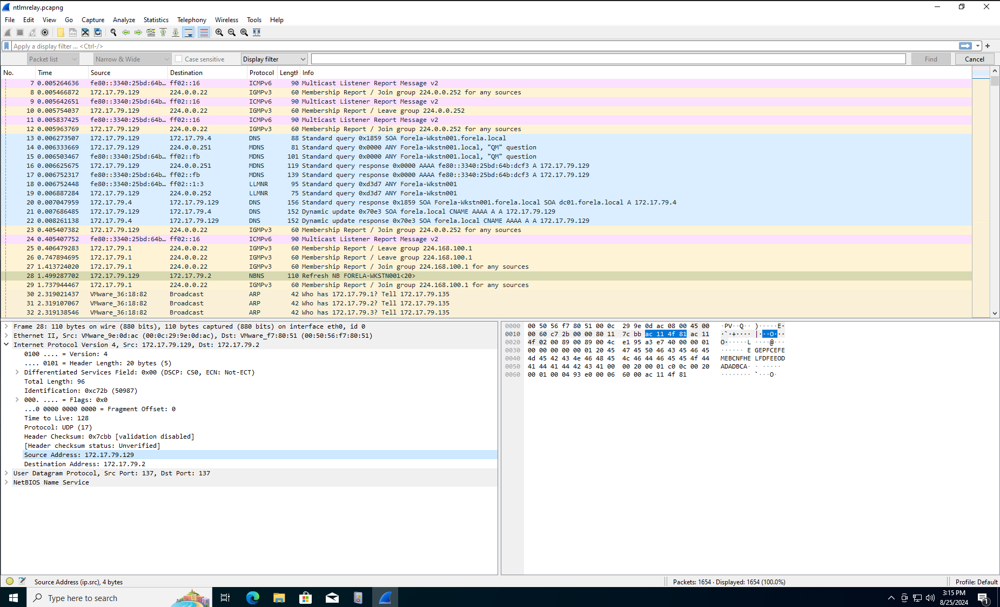

## Lets get Labbing

Okay so I just discovered Hack The Box Sherlocks, they are Blue Team focused labs that test your SOC Analyst skills. Useful for sharping and displaying knowledge and skills. There looks to be a lot of them which is great, so I decided to jump right in and take a stab at the first lab, a retired lab called Reaper. 
<!-- truncate -->

## Reaper

So, I am on the page and ready to start. I proceeded to read through the scenario, which reads as follows: 

> Our SIEM alerted us to a suspicious logon event which needs to be looked at immediately . The alert details were that the IP Address and the Source Workstfation name were a mismatch .You are provided a network capture and event logs from the surrounding time around the incident timeframe. Corelate the given evidence and report back to your SOC Manager.

Then I downloaded the files for the lab and took a look at them. Here is what they look like:

Okay so we have a `.evtx` file which is most likely a Windows Log file and also a `.pcapng` file that is a network capture of the event. 

Before I proceeded I was asking myself if I needed to spin up a Windows VM or this as the computer that I am using is running Ubuntu Linux. Also, during the Windows Event Log: Finding Evil module for the HTB CDSA, all `.etvw` files where opened using Windows tools like the Event Viewer, SilkETW, and the PowerShell cmd-let `get-winevent`. Now I know there are most likely tools for viewing of these logs on Linux but, for posterity I will use the tools I learned about. Guess it's time to spin up that Windows VM. 

installed Gnome Boxes as I heard it was the most minimal type 2 hypervisor for Debian based Linux distros. Downloaded the latest Windows 10 ISO and completed the install. Landing at the desktop I installed spice-webav guest tools, this makes it easier to move files to and from the host to guest OS and vise versa. I also installed 7-Zip as the native Windows OS archive tool does not support password protected `.zip` files. WireShark was also installed on the machine for a nice GUI-based interface that I can use to filter and investigate the `.pcap` file mentioned above. And not bam, here we are at the desktop all ready to go all cyber detective and everything. 

## Task 1: What is the IP Address for Forela-Wkstn001?

Okay, so the first question is asking us for the IP address of the computer hostname **Forela-Wkstn001** so most likely we will be looking at the pcap file as that contains all of the network monitoring logs, which contain details of connections to and from the network, protocols used, IP addresses, MAC addresses etc. 

Okay so with the pcap file open in WireShark and scrolling through without any filtering I can already see a log form the computer mentioned in the task info. Looks like the NetBios service running on our target machine was attempting to update information of some sort and we can clearly see the source IP address, which is `172.17.79.129`.

### What is NetBios?

NetBios is a network protocol that is used for layer 5 (OSI Model) communication over a local network, this communication happens between computers on the local network exchanging data like DNS info, printer sharing, and session management. It's a legacy protocol that was used heavily on older versions of Windows but, now not so much. Note that Linux does not natively use NetBios in it's networking stack but, most distros of Linux have access to a tool called `netbios-utils`, a command-line utility for interacting with NetBios and other systems using it. 

## Task 2: What is the IP Address for Forela-Wkstn002?

Task 2 is the same exact question but this time for computer **Forela-Wkstn002**. This time we will make use of WireSharks string search abilities. 

And yet again we have more NetBios communication and the revealing of the source IP address of the machine, `172.17.79.136` 

## Task 3: Which user account's hash was stolen by attacker?

Task 3 is to figure out which account had its' hash stolen. Wondering if this could be related to the old NetBios protocol being used. If we look at the logs provided and filter for Windows Logon events, Event Code: `4624`, the last 3 entries look very suspicious.

Now if we take a look at the event we can see what looks to be a malicious logon. How do we know it was malicious though? Well, we can see that the **Security ID, Account Name, Account Domain, and Logon ID** all look to be invalid values. Scrolling down further, we can see more indicators of compromise.

Above we can see that a new user was logged on to, `aurthur.kyle` from the Domain `FORELA`. This is the first instance of this user logging on in the logs. 
Also NTLM was used for the logon as you can see from the next image. 

### What is NTLM

NTLM is another legacy protocol (lol, sensing a pattern here), that was originally developed in 1990's and was used by the Windows OS as an authentication protocol, it was specifically useful for authenticating systems and users in environments where the domain controller was not available. 

NTLM is also exploitable via Replay and Pass-The-Hash Attacks, and from the looks of it and taking into account the task question, I believe this is what took place. 

## Task 4: What is the IP Address of Unknown Device used by the attacker to intercept credentials?

This one was easy as the same set of logs that we looked at from the previous task can be used to answer this one. The set of logons using NTLM and the user account `arthur.kyle` all originated from the IP `172.17.79.135`. This can be seen in the Network Information section of the provided windows log file and also in the PCAP file as well. 

Filtering for the `ntlmssp` protocol in Wireshark displays logs pertaining to NTLM negotiation and NTLM authentication. 

## Task 5: What was the fileshare navigated by the victim user account?

For this task I had already peeped that there were some events pertaining to SMB shares. *I took a look at the hint for this one which read as follows:* 

> Filter for smb2 traffic in wireshark. Search for keywords "BAD_NETWORK_NAME" in packet details.

Okay so lets filter for smb2 traffic. After applying the filter and scrolling down, I see the "BAD_NETWORK_NAME" string come up in a set of logs. 

This reveals the SMB share that was navigated to, which was `\\DCO01\Trip`. 

## Task 6: What is the source port used to logon to target workstation using the compromised account?

Another easy question as the information is contained in sections of both log files that we've looked at already. Image below shows the source port of the logon for the compromised account `aurthur.kyle`. 

As we can see from the image above the source port for the malicious NTLM logon was port `40252`, which is an ephemeral port, used for temporary outbound connections.  

## Task 7: What is the Logon ID for the malicious session?

This can also be found in the same event in the Windows Log file specifically in the *New Logon* section. 
As you can see from the image, the Logon ID is `0x64A799`

## Task 8: What is the workstation name and the source IP Address from which the malicious logon occur?

Task description also states that, *"The detection was based on the mismatch of hostname and the assigned IP Address"*. Which I noticed as in the beginning tasks, we established that **Forela-Wkstn001** had an IP of **172.17.79.129** and that  **Forela-Wkstn002** had an IP of **172.17.79.136**. Looking at the log event for the malicious logon we find the following. 

The logon attempt happened on the **Forela-Wkstn002** machine but, from an IP address that is different, **172.17.79.135**. 

## Task 9: When did the malicious logon happened. Please make sure the timestamp is in UTC?

Alright, so same log event and this time a different set of data needed. Also, we must note that the task requests us to change the time to UTC so, depending on the machine your are viewing the logs on, and it's configured time zone, the time of the actual event will need to be adjusted to take this into account. 

I like in the EST time zone so, the time of the event in EST was 12:55:16, converting that into UTC we get, 04:55:16.

The final complete answer, including the date as well as the time was `2024-07-31 04:55:16`. 

## Task 10: What is the share Name accessed as part of the authentication process by the malicious tool used by the attacker?

The last and final task of the Sherlock lab. The answer I saw in passing while browsing through the the log looking for answers to other tasks and getting the lay of the land in terms of what took place. I found that the  Windows event code for file shares is `5140` after a quick google search. I applied the filter to the log file in Event Viewer and got the following. 

A single event that took place at the exact same time as the suspicious logon via NTLM, what a coincidence😝. The share accessed was `\\*\IPC$`. 

## Mission Complete!

