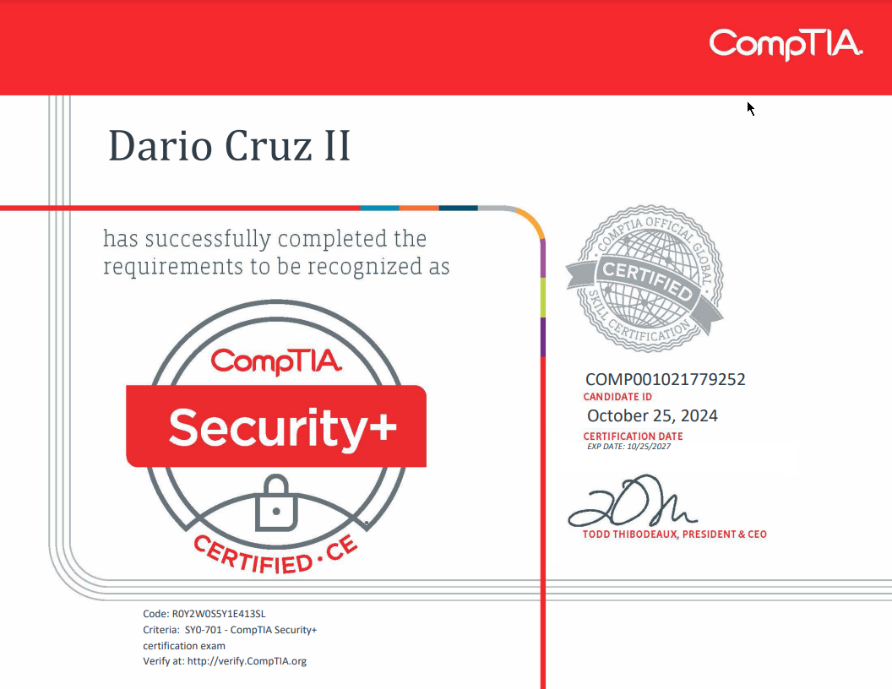

Hey all,

Apologies for the radio silence! Work has ramped up, and I've been focused on my studies, as you can see. 😆 Last Friday, on Oct 25, I sat down and took the Security+ SY0-701 certification exam—and passed! 🎉
<!-- truncate -->

## The Exam Experience
Out of all the exams I have taken so far, I feel that the difficulty level of this exam was moderate. It would be harder if you took the exam without any prior IT experience. My exam comprised 3 performance-based questions, in which I had to use my knowledge to complete a set of tasks, and 72 multiple-choice questions—75 questions in total. As long as you have a study guide or a video course that covers all the exam domains, you should be fine. I took the time to dig deeper into specific topics, most notably **Cryptography** and **Public Key Infrastructure**, as those topics alone contain a wide range of technologies and concepts.

Additionally, it's pretty important to have a good set of practice exams. For this exam, I didn’t use Anki flashcards. My thinking was that, since I had already learned most of the content through the Google Cybersecurity Professional course, I wouldn’t need additional reinforcement as the concepts were already set in my memory. This approach worked well; any reinforcement of knowledge came from the practice exams, which gave me the needed feel of taking the actual test. My mind was ready! 🤓

## Resources
Here is a list of all of the resources that I used to study for the exam:
- [SY0-701 Study Guide by Joe Shelly & Darril Gibson](https://www.amazon.com/CompTIA-Security-Get-Certified-Ahead/dp/B0CM13W88J/ref=sr_1_4?crid=17IQW8C9GRB45&dib=eyJ2IjoiMSJ9.KLwV9SPIB7iofREYr9NL4oNcF-LaIpRh9KHPr1EbVF8M_Ab8IJNiykb57TuvgtB--eez8bj1biPogxJBHHmBcMMVrxQJphARhMSI-wsXtwXi97wgpW4NKRStew5uBpCOe5-xAEVX6B79opQoJWMOzm-JmDkD4EDK-9KQfv59Pp8ginqCP6ZB08qXB7rEFX4ogZ_w_VN1uFp4KMYG6hWR3jEOVziFRPC5Zno3rav0cAw.Y0V_3IKnVq8szP6-AV0diTzQXXUrjePowAvGjylbG38&dib_tag=se&keywords=security%2B+701&qid=1730214671&sprefix=security%2B+%2Caps%2C229&sr=8-4)
- [Josh Madakor Security+ Practice Questions - LognPacific](https://lognpacific.com/free-certification-practice-tests/free-security-sy0-701-practice-questions/)
- [WhizLabs Security+ SY0-701 Practice Exams](https://www.whizlabs.com/comptia-security-plus-sy0-701/)
