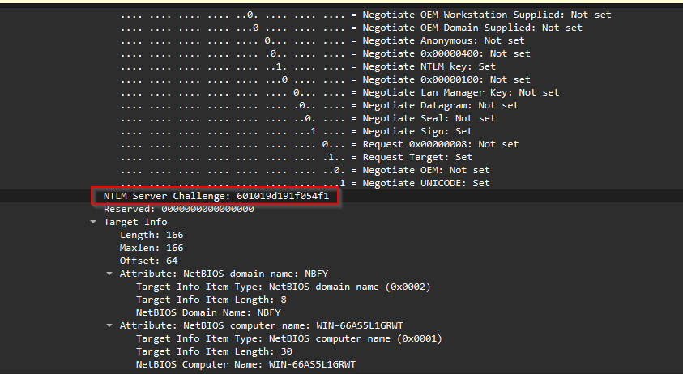

Okay, lets get back into it! Time for another Sherlock investigation.🕵️‍♂️
## Scenario
> The IDS device alerted us to a possible rogue device in the internal Active Directory network. The Intrusion Detection System also indicated signs of LLMNR traffic, which is unusual. It is suspected that an LLMNR poisoning attack occurred. The LLMNR traffic was directed towards Forela-WKstn002, which has the IP address 172.17.79.136. A limited packet capture from the surrounding time is provided to you, our Network Forensics expert. Since this occurred in the Active Directory VLAN, it is suggested that we perform network threat hunting with the Active Directory attack vector in mind, specifically focusing on LLMNR poisoning. 
## The Files
Okay so in the zip file for the Sherlock we have a single `.pcap` file which means we will be flexing our Wireshark/TCPdump skills in this investigation. 
<!-- truncate -->
## Task 1
**Its suspected by the security team that there was a rogue device in Forela's internal network running responder tool to perform an LLMNR Poisoning attack. Please find the malicious IP Address of the machine.**

Hmmmm, okay so the acronym LLMNR is new to me, so it's time to educate myself on that it means, and also how it can be used by a threat actor that has access to an organizations network. 
### Link-Local Multicast Name Resolution
So, it's a network protocol, and it's based on the DNS packet format. It allows both IPv4 and IPv6 hosts and devices to perform name resolution on the same network link. [^1]

[^1]: https://en.wikipedia.org/wiki/Link-Local_Multicast_Name_Resolution
### How LLMNR works
Okay so digging deeper into how the protocol works, so that we know what the normal baseline behavior should be, looking at this image [^3] it looks like LLMNR works similar to DNS, meaning that a central server is responsible for requests, this means that any deviation in where requests are sent and responded to, should provide us with information on the machine that is on the network carrying out the attack. 
#### LLMNR Poisoning Attacks
How can LLMNR be poisoned? How can it be used to attack a system? According to [this article](https://attack.mitre.org/techniques/T1557/001/) from MITRE, adversaries will spoof and present themselves as an authoritative source for name resolution, allowing for the threat actor to collect and/or relay authentication data. Yikes! Threat actors will respond to LLMNR requests as though they know the identity of the requested host, poisoning the service and getting the victims to communicate with the threat actor controlled system. 

The goal of the attack is to collect hashes used in authentication which could be used for cracking of the hashes via offline brute forcing, leading to the obtaining of account passwords. [^2]

[^2]: https://attack.mitre.org/techniques/T1557/001/
[^3]: https://www.aptive.co.uk/wp-content/uploads/2017/02/responder-llmnr-netbios-name-server-spoofing.png

##### Detection
Lucky for us, on the same page of this article MITRE provides information on how to detect the incident. More specifically, since we only have access to the pcap of the security incident and not the Windows logs of the machines affected, we can narrow our focus to the Network Traffic data source. 

- Monitor network traffic on UDP Ports **5355** and UDP **137**, if LNMR is disabled via security policy. 
- Monitor network traffic originating from **unknown/unexpected hardware devices**. 
### Investigating Further
Okay so now it's time to open up that `.pcap` file and start the investigation, we are looking for the IP address of the machine that is carrying out the LLNMR poisoning attack. From our enumeration and information gathering, we know that the ports to check are UPD **5355** & **137**, so in Wireshark we will filter for that starting with port **5355**, `upd.port == 5355`. 


Looking at the above image we can see a series of normal requests to the DC01 server, the server is processing the requests form machines on the network as normal. 

Scrolling down further reveals some intriguing network traffic. 

Towards the end of the pcap file we can see that query responses are no longer coming from the DC01 server. Query responses are now being handled by **172.17.79.135**, which is the IP address needed answer the task question.
## Task 2
**What is the hostname of the rogue machine?** 
Okay so now that we know the IP address of the machine that is carrying out the LLMNR poisoning attack, it should be easy to find the hostname of the machine. 

Taking what we have learned form the MITRE information on LLMNR poisoning attacks and how they are carried out, we know we can use DHCP to potentially find information on the threat actor machine. So, back into Wireshark we go, filtering for the IP address that we have found and narrowing down the search by scoping down to only DHCP protocol activity. With that we get 3 network events.

With the 3 log events we can see that there was a DHCP request from this IP address. and digging into the log details we see that there is a field for the hostname of the requesting computer, in this case the threat actors machine hostname is **kali**. (Kali Linux bby!😎)
## Task 3
**Now we need to confirm whether the attacker captured the user's hash and it is crackable!! What is the username whose hash was captured?**
### LLMNR Poisoning and Hashes
Okay so how are LLMNR attacks related to password hashes and the cracking of them? For this lets go back to the MITRE documentation on the attack. Reading through the material, I found this snippet that explains how hashes can be obtained as a result LLMNR poisoning attacks:
> (After initial LLMNR poisoning has been carried out.)  If the requested host belongs to a resource that requires identification/authentication, the username and NTLMv2 hash will then be sent to the adversary controlled system. The adversary can then collect the hash information sent over the wire through tools that monitor the ports for traffic or through [Network Sniffing](https://attack.mitre.org/techniques/T1040) and crack the hashes offline through [Brute Force](https://attack.mitre.org/techniques/T1110) to obtain the plaintext passwords.

and also...
>In some cases where an adversary has access to a system that is in the authentication path between systems or when automated scans that use credentials attempt to authenticate to an adversary controlled system, the NTLMv1/v2 hashes can be intercepted and relayed to access and execute code against a target system.
### Further investigation
Okay so now that we know that the threat actor could potentially be exploiting LLMNR to carry out poisoning and a man-in-the-middle attack to obtain hashes and crack those hashes and attempt to login to a compromised account via NTLM, we will look for indicators of such via further Wireshark filtering. 

First lets filter for NTLM traffic, and oh boy we find some clear indicators...

Looks like we are getting some brute force traffic on the SMB port 412 and also multiple session setup requests on the user account **Forela\john.deacon**, the final answer to the task question being **john.deacon**. 
## Task 4
**In NTLM traffic we can see that the victim credentials were relayed multiple times to the attacker's machine. When were the hashes captured the First time?**

Pretty straight forward, as we have already filtered for smb2 traffic. We can look at the time stamps and check for the first instance of the **john.deacon** user account hash being brute forced over the network. 

The brute forcing of the hash for user account john.deacon took place on **2024-06-24 11:18:30**.
## Task 5
**What was the typo made by the victim when navigating to the file share that caused his credentials to be leaked?**

Okay so we have information that the user john.deacon made a typo in the SMB share why does this matter and how did it leak the credentials of the users account? This probably has to do with the LNMRR poisoning as smb share hostnames are resolved to IP addresses and where does that resolution happen, via DNS and in this case with the dual IP addressing protocol nature of the network, LNMRR. So lets take a look at those network logs. 

So we see some broadcast traffic of the server DC01 announcing it's presence. SMB servers have a feature that allows them to advertise their presence on a local network, for security this should probably be disabled as it allows threat actors to enumerate smb servers and shares and potentially exploit them. 

Looking back at the network logs of the LLNMR attack, we can see that the victim that had their credentials compromised had mistakenly typed the hostname **DCC01** when attempting to access the smb server/shares. 

## Task 6
**To get the actual credentials of the victim user we need to stitch together multiple values from the ntlm negotiation packets. What is the NTLM server challenge value?**

For this one a roped in ChatGPT for some clarification on the NTLM protocol and the structure of it's packets. The task charges us with finding the *server challenge value* and that, *"To get the actual credentials of the victim we need to stich together multiple values from the NTLM negotiation packets"*.
### Educating myself with ChatGPT
I prompted ChatGPT with the following message:
> Explain the structure of ntlm negotiation packets. The context for this task is that I am investigation a security incident, and I need to obtain the NTLM server challenge value that the threat actor obtained.

And ChatGPT proceeded to give me a wealth of information. More specifically, instructions on how to extract the server challenge value, nice! 😎

> [!NOTE] Steps to Extract the Server Challenge Value 
>1. **Capture NTLM Traffic**:
>    - Use network monitoring tools like Wireshark to capture the traffic during the NTLM authentication process.
>    - Apply filters in Wireshark to isolate NTLM packets. The filter `ntlmssp` can be used to find these packets specifically.
>2. **Locate the NTLM Challenge Message**:
>    - Look for the message with a type field of `0x00000002`, which indicates the NTLM challenge message.
>3. **Extract the Server Challenge**:
>    - The server challenge is located 8 bytes after the "Negotiate Flags" field.
>    - In Wireshark, expand the NTLMSSP fields within the NTLM challenge message to locate the "Server Challenge".
>    - The value will be a 64-bit (8-byte) hexadecimal number (e.g., `0xA1B2C3D4E5F6A7B8`).
>4. **Verify the Challenge**:
>    - Ensure that the challenge aligns with the expected structure, and cross-reference with other packets to see how the client responded using this challenge.
### The Solution
ChatGPT broke it down for me and now I have the details I need to hunt for the answer, NTLM has a series of steps for the authentication process, there are 3 different packets, which are the following, Negotiation Message, Challenge Message, and Authentication Message. The NTLM Challenge packets will be the ones that we are targeting. 

Back to Wireshark we filter for `ntlmssp` packets and we can see the Challenge Message packets clearly.

Looking at the first of the challenge packets details, scrolling down to the NTLM specific parts of the packet we can see the first challenge message, from when the threat actor carried out their brute force of the users account. 

The NTLM server challenge value for the first challenge packet is **601019d191f054f1**, which is the answer to the task question. 
## Task 7
**Now doing something similar find the NTProofStr value.**

Now our target is the NTProofStr value but, wait what is that? Looking back at the ChatGPT info there is no mention of this value in the information provided....
> [!NOTE] Hey ChatGPT what is NTProofStr in relation to the NTLM protocol?
> Response: 
> *In the NTLM protocol, **`NTProofStr`** (often called **NT Proof String**) is a key component of the NTLMv2 authentication process. It is a critical part of the client's response during the authentication process, specifically in the **NTLM Authenticate Message**.*

Cool, so now we need to target and filter for the ntlm authentication packets and look for the value of the NTProofStr.

Looking at the packet that came right after the first ntlm challenge, we see an NTLM authentication packet, attempting to authenticate the user `john.deacon`.

Now looking at the details of the NTLM authentication packet, we see the response type, and also the NTProofStr value, which is **c0cc803a6d9fb5a9082253a04dbd4cd4**.

## Task 8
**To test the password complexity, try recovering the password from the information found from packet capture. This is a crucial step as this way we can find whether the attacker was able to crack this and how quickly.**

So we need to recover the password? Well, okay lets research how to do that. ChatGPT comes into play again and I ask it the following:

> [!NOTE] How do threat actors crack user passwords using the NTLM protocol?
> *Response Highlights:*
>**NTLM hashes** are representations of the user’s password in hash form, which is used during authentication instead of the plaintext password. If an attacker can capture these hashes (e.g., through a network sniffing attack or by extracting them from compromised machines), they can attempt to crack them offline.
>
>If an attacker captures the NTLM hash `aad3b435b51404eeaad3b435b51404ee:32ed87bdb5fbb310bc9ef504a40265b1`, they can attempt to use **Hashcat** with a wordlist to brute-force the plaintext password.

Looks like we have to gather the hashes from the NTLM packets and attempt to crack them with **Hashcat**. I spun up a Linux VM and proceeded to install hash cat and look for wordlists to use. 


Running Hashcat for the first time with the -h flag(help menu) shows all the flags, parameters and how they can be used to crack hashes or complete other tasks. The list is expansive. 


Looking for wordlists I found this resource on github, https://github.com/gmelodie/awesome-wordlists and proceeded to download the *RockYou* password list as the description read, *The go-to wordlist for passwords*. 

After getting the wordlists and hashcat installed I looked for some guidance on basic usage of the cli app and found an article on freecodecamp https://www.freecodecamp.org/news/hacking-with-hashcat-a-practical-guide/. The syntax we should use to brute force and find that password should be the following
```bash
hashcat -m 0 -a0 hashes.txt rockyou.txt
```
### Cracking NTLM
I went ahead and created a folder that store the `rockyou.txt` and also the `hashes.txt` files. We need to gather the hashes from the `.pcap` file and place them in the hashes file so that 
HashCat can process them and find a match.
#### NTLM Challenge Response
After doing some research on the NTLM protocol and how threat actors exploit the way it works, in order to carry out **Man-In-The-Middle** attacks, I found that the NTLM Challenge Response is the field that contains the hash-based validation of the password, along with other information, like the **NTProofStr** value that we collected earlier. 

So I gathered all the NTLMv2 response hashes from the packet capture file and stored in the `hashes.txt` file, so that they can be access an processed using hashcat.

There was an issue though, when attempting to run hashcat on the file, with the proper syntax, hashcat was presenting me with errors about the hash format. 

Here is the syntax that I used after looking at the documentation for hashcat and the guide on how to use it, that I found on [freecodecamp](https://www.freecodecamp.org/news/hacking-with-hashcat-a-practical-guide/).
```bash
hashcat -m 5600 -a 0 -o cracked.txt hashes.txt rockyou.txt
```
*The `-m 5600` flag and arg, tell hash cast to use the HMAC-MD5 hashing algorithm, which is the hashing method that NTLMv2 uses. The `-a 0` configures hashcat to carry out a normal Dictionary Attack using the provided wordlist in the `rockyou.txt` file. Lastly, the `-o` flag specifies where the results of the process should be stored, which is inside of the `cracked.txt` file.*

I began to dig into what the cause of the issue was and see how I could correct the formatting. Doing google searches and ChatGPT queries. I came across this video, which detailed, how to obtain the NTLMv2 hash, along with other information that hashcat required, as well has how to format the file that stored the information. *Super useful!😄  Shoutout to [Embrace The Red](https://www.youtube.com/@embracethered)🍻*

<iframe width="560" height="315" src="https://www.youtube.com/embed/lhhlgoMjM7o?si=Mx6wIhsMwPTYCJvz" title="YouTube video player" frameborder="0" allow="accelerometer; autoplay; clipboard-write; encrypted-media; gyroscope; picture-in-picture; web-share" referrerpolicy="strict-origin-when-cross-origin" allowfullscreen></iframe>

Looks like the format of the content in the file needs to be structured via  the format: 
```
username::domain::challenge_value::HMAC-MD5_value::NTLMv2Resposne(Without fist 16 bytes)
```
So I created a new file `ntlm-hashes.txt` and typed out the needed format. Time to gather the data from the packet capture file. 

First we need the **NTLM Server Challenge** value. Looking at the packet capture this would be the first packet that is sent to the NTLM server, by the client, requesting authentication and access. I my case I am targeting the first 3 packets in the capture file, after filtering for `ntlmssp`. 


Second, we need the **NTLMv2 Response**, which we find in the same packet further down the packet details, just like in our previous attempt.

Third, we need to obtain the **HMAC-MD5** value for hashcat, according to the information in the video, the **NTProofStr** is the HMAC-MD5 value. It is also the first 16 bytes of the challenge response. 

And for the last two values, User and Domain, we scroll down further in the packet details to find those values under the *domain name* & *user name* attributes. 

Here we have, the final result of gathering all the need attribute values stored in the `ntlm-hashes.txt`.
```
john.deacon::FORELA: 53b0e5778af9adfb:8573cf0b2b03b84ba6caef21cd43a303:010100000000000080e4d59406c6da0153b0e57....
```
Now we use hashcat to do an offline brute force of the NTLMv2 hash. Below is the refined command to run:
```shell
hashcat -a0 -m5600 ntlm-hashes.txt rockyou.txt
```
And here is the terminal output from the command and the resulting password for the user account. 

**The answer to the task question is the password `NotMyPassword0k?`**
## Task 9
**Just to get more context surrounding the incident, what is the actual file share that the victim was trying to navigate to?**

For this task we will need to take a look at the log files that lead up to the malicious event. We know that the user was attempting to access a file share but, entered the wrong file share path, which in turn lead to their account becoming compromised.  In task 5 we found the typo that the user had mistakenly typed in, which was `DCC01`. Looking through the packet capture file, we can see that right before the LLMNR pensioning took place, the user was attempting to access the file share, **`\\DC01\DC-Confidential`**, which is the answer to the Task 9 Question.

## **Key Takeaways**
- **LLMNR (Link-Local Multicast Name Resolution)** is a protocol that is used in Windows networks, it allows for the resolution of local network hostnames to IP addresses when DNS is not available. It is susceptible to **Man-in-the-middle (MITM) & Poisoning Attacks**, due to it's lack of *verifying the identity of devices that respond to the name resolution requests*. **Poisoning of LLMNR** takes place when a threat actor exploits this lack of *verification* and **impersonates the the LLMNR requesting service**, allowing for the threat actor to receive traffic flows that contain sensitive information, which in this case lead to an corresponding **NTLMv2 hash brute force**.
- **NTLM(Windows New Technology LAN Manager)** and it's **Version 2** variant are used to *authenticate users* via a **challenge-response mechanism**. With **NTLMv2** the challenge-response mechanism uses HMAC-MD5 hashes that can be obtained via *traffic capture* or *Man-In-The-Middle attacks* and used for *offline brute forcing*, using a number of tools that are available, including the tool which we used for this investigation, *HashCat*. NTLM as a protocol should be disabled as is has been *[deprecated by Microsoft](https://learn.microsoft.com/en-us/windows/whats-new/deprecated-features)*, and there are more modern protocols like Kerberos that accomplish the same functionality while being secure. 
