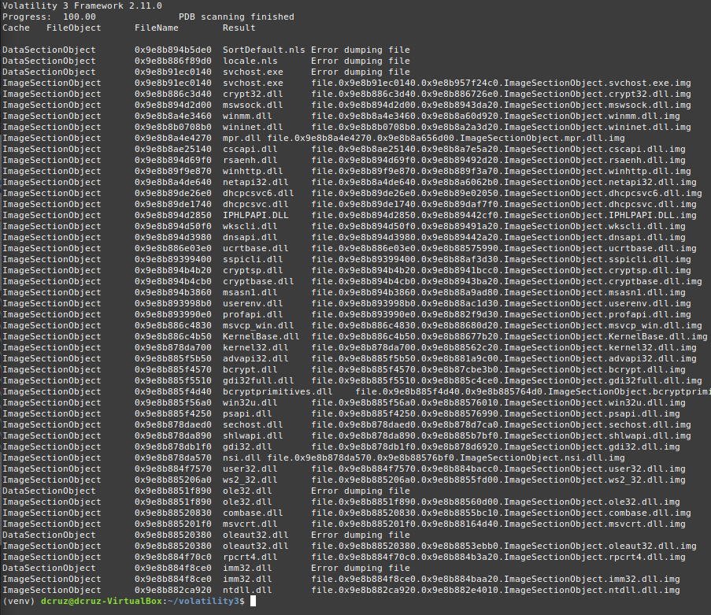
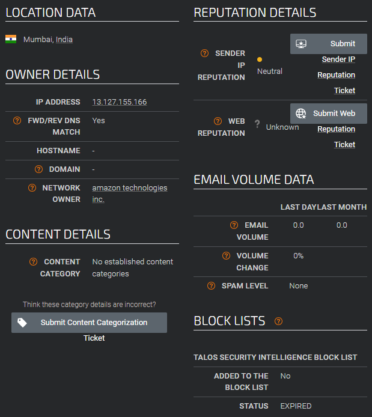

It's that time again, lets dig into another investigation, this time it looks like we will be digging into memory forensics. 🕵️‍♂️🤓🔎
<!-- truncate -->
## Scenario
>Your SIEM system generated multiple alerts in less than a minute, indicating potential C2 communication from Simon Stark's workstation. Despite Simon not noticing anything unusual, the IT team had him share screenshots of his task manager to check for any unusual processes. No suspicious processes were found, yet alerts about C2 communications persisted. The SOC manager then directed the immediate containment of the workstation and a memory dump for analysis. As a memory forensics expert, you are tasked with assisting the SOC team at Forela to investigate and resolve this urgent incident.
### What are C2 communications
This term is new to me, so time to do some research to gain more context into the event. After doing some googling I found that C2 just stands for **Command & Control**, meaning that the computer is potentially compromised and could be part of a botnet. Yikes!😬
### The Provided Files
For this investigation the zip file is 1gig in size. Looks like we will be sifting through a lot of data. The file stored inside of the zip file is a `.mem` file, which I have not used before but, makes sense as in the given scenario, it's stated that a memory dump is provided for analysis. 
### Memory Analysis Software (Volatility)
I looked into the different types of software used by SOC teams, to analyze `.mem` files and I came across **[Volatility Framework](https://volatilityfoundation.org/)**, an open-source tool that is used for memory forensics. I went ahead and followed the instructions on the [github page](https://github.com/volatilityfoundation/volatility3) for installing the needed dependencies(python3) and Volatility 3 on a Linux VM.

I also needed to create a python virtual environment for use for volatility. Python virtual environments are used to isolate dependencies for projects, instead of installing dependencies globally, which is messy and could cause issues down the road. I went ahead and attempted to create and environment using the following command:
```bash
python3 -m venv venv
```
I was met with the following message that I did not have the needed package installed, `python3.12-venv`. 

I used the command provided along with `sudo` to install the needed package. 
```bash
sudo apt install python3.12-venv -y
```
Now we need to activate the python environment via the following command. 
```bash
source venv/bin/active
```
Our virtual python environment should now be active, you can observe this via the terminal output, which now includes `(venv)`.


And finally, as you can see from the image above, we can now run volatility commands.
## Task 1 & 2
1. **Please identify the malicious process and confirm process id of malicious process.**
2. **The SOC team believe the malicious process may spawned another process which enabled threat actor to execute commands. What is the process ID of that child process?**

So now that we have volatility3 installed and running we can run commands to accomplish various functions. Doing `python vol.py -h` brings up the following output. 

Which provides a useful list of flags, arguments and parameters that can be used with the command line utility. The flag, `-f` allows for specifying of a file to process and analyze, this then must be followed with a value for the plugin to be used on the file. In the case of this question we need to look at the processes that were running on the machine at the time the SOC team was alerted and captured a memory dump of the affected machine. Looking at the list of plugins available from the fresh install, I can see that there is a plugin called `windows.pslist`, which allows listing of processes that are present in the target windows memory image.

So now we craft the final command to get the processes, we call python to run `vol.py`, adding the `-f` flag and specifying the target file which is, in my case located on an attached folder share to the VM. File path to the memory dump we need to analyze for this lab is `/media/sf_D_DRIVE/HTB-Sherlocks/RogueOne/20230810.mem`. Then we envoke the plugin we need, so that we can get the intended output, `windows.pslist`. 
The final command:
```bash
python vol.py -f /media/sf_D_DRIVE/HTB-Sherlocks/RogueOne/20230810.mem windows.pslist
```

Running the command gives us a list of all of the processes, that of which there are many.


I went ahead and ran the program again by this time piping the output to a text file that could be searched through and analyzes in greater detail. 
```bash
python vol.py -f /media/sf_D_DRIVE/HTB-Sherlocks/RogueOne/20230810.mem windows.pslist > pslist_output.txt
```
After running the above command we can now use the `cat` and `grep` command line utilities to display and filter the content contained within the created text file. 

### Investigating the Output
Looking through the list of processes there are no processes that are named suspiciously at first glance. We do have two *Process ID (PID)* rows though, one for regular PID values and a second for a *Parent Process ID (PPID)* which are processes that have been spawned from other running processes. Threat actors may do what is called, ***Living off The Land (LOTL)*** which is a technique that allows threat actors obfuscate there activity and avoid detection via using the software included in the operating system and whatever applications the user has installed that may be vulnerable. 

Taking all of that into account, if we look toward the bottom of the pslist_output file, we can see two processes for `cmd.exe`, the running of command prompt it's self is not a red flag, though normal end-users for the most part will not be launching that application on a regular basis. The red flag in this case are the parent processes that have spawned both instances of `cmd.exe`.  Lets use both the `cat` & `grep` cmd line utilities to filter the `pslist_output.txt` file and gain more insight.


Using `cat` to display the output and `grep` to filter for `cmd.exe` we can see that the parent PID's, which are `936` & `6812`. Filtering for both of these PIDs brings up two distinct `svchost.exe` processes. 

### svchost.exe
Digging into the information on the svchost process, I found that it's known as the Service Host. It is an integral system process for the Windows Operating system and acts as a host/manager for *DLL-Based* Windows Services. Essentially is manages **background** services allowing the OS to run efficiently. 

I also found that `svchost.exe` spawning the `cmd.exe` process is not considered to be normal behavior for the process and is a clear indicator of compromise. Also when filtering for all of the `svchost.exe` processes, they all share the same *PPID* except for the `svchost.exe` processes that spawned `cmd.exe`. 

### The Answers
So now that we have done our investigation and analysis of the processes that were running at the time of detection, we can answer the questions in both Task 1 and in Task 2.
#### Please identify the malicious process and confirm process id of malicious process.
The malicious process in this case is the `svchost.exe (6812)` process that spawned the `cmd.exe (4364)`. Since they ask for the process ID as input, it would be **6812**.
#### The SOC team believe the malicious process may spawned another process which enabled threat actor to execute commands. What is the process ID of that child process?
That would be the child process, that `svchost.exe` spawned, the `cmd.exe` process that has a PID of **4364**.
## Task 3
- **The reverse engineering team need the malicious file sample to analyze. Your SOC manager instructed you to find the hash of the file and then forward the sample to reverse engineering team. What's the md5 hash of the malicious file?**

We need to get the MD5 hash of the malicious `svchost.exe` file. I ran volatility3 with the `-h ` flag so that I could see all the the options and plugins available. I narrowed down the search using `grep` to filter for any occurrences of the the word *file*. This should provide a function/plugin that will allow us to see the files in the filesystem of the memory dump file. 

Looks there is a function/plugin called **windows.filescan**, which after some research, I found that it allows for listing of all file objects that were found in memory at the time of the dump. 


Using this function/plugin, along with `grep` filter the output and place it into a text file, using the command below. 
```bash
python vol.py -f python vol.py -f /media/sf_D_DRIVE/HTB-Sherlocks/RogueOne/20230810.mem windows.filescan | grep svchost.exe > svchost_filescan.txt
```

Looking through the `svchost_filescan.txt` I can clearly see an `svchost.exe` file located in a folder that is not in the Windows directory, located in a the user, **simon-stark's**, downloads folder.  

### File Extraction
We now know the location of the malicious file but, are we able to extract it out of the memory dump file? Does volatility3 have the functionality to do this? The answer to both questions is **yes**. 

When I was looking up functions/plugins to use in order to list all of the files in the memory dump, I cam across the plugin `windows.dumpfiles`.

Now we craft the complete command so that we can extract the file out of the memory dump.
```bash
python vol.py -f /media/sf_D_DRIVE/HTB-Sherlocks/RogueOne/20230810.mem windows.dumpfiles --pid 6812 
```

Above you can see that the `svchost.exe` was dumped out an an `.img` file, along with the DLLs that the application must have been accessing to run. The `.img` file is a raw dump format that is a binary blob of the file as it appeared in memory at the time of capture. 
### Hashing
Now that we have the image file of the malicious file we need to get a hash of the file to provide to the reverse engineering team mentioned in the task. To do this we can use the pre-installed **md5sum** command line utility. Most distributions of Linux have this utility installed by default as a part of the GNU Core Utilities package. 

The command used to get the md5sum is as follows:
```bash
md5sum file.0x9e8b91ec0140.0x9e8b957f24c0.ImageSectionObject.svchost.exe.img
```
Which gives use the output, containing the MD5 hash and the filename. The hash being **5bd547c6f5bfc4858fe62c8867acfbb5**, which is the answer to Task 3.
## Task 4
- **In order to find the scope of the incident, the SOC manager has deployed a threat hunting team to sweep across the environment for any indicator of compromise. It would be a great help to the team if you are able to confirm the C2 IP address and ports so our team can utilize these in their sweep.**

This task requires us to dig into the `windows.netscan` plugin that is pre-installed with Volatility3. With the Linux Mint VM that I had setup, volatility was not detecting that the memory dump file had data that could be scanned with the plugin, so I created a new VM and installed Kali Purple, which is a Linux distro targeted at purple/blue team use, which is more suitable for carrying out investigations and also has a lot of SOC Analyst software pre-installed. 

I believe now, after looking into the situation, that the file had been only partially extracted from the archive, the memory dump that I was accessing with volatility3 was only 2.7gb in size, with the file in kali purple, after fully being extracted from the archive, was around 4gb in size. Whoops!😝

So, here is the truncated output.

The first thing that jumps out to be is a connection to an IP address, **13.127.155.166** with the port **8888**. 

From what I know about services, networking, and ports, and from running some services on home server, port 8888 is used for some self-hosted services. I did some research on the port and what it has been historically used for. [WhatPortIs.com](https://whatportis.com/ports/8888_http-web-interface-alternative) states that the port is commonly used for http & https traffic as an alternative port, if there are multiple services providing http/https functionality. [SpeedGuide.net](https://www.speedguide.net/port.php?port=8888) states that the port is used for *"allhttpd"* but, also states that it could be related to malware and trojans, things are looking fishy 🐟.

Moving on to the IP address, I did some research on websites that contained databases of IP addresses that could be associated with botnets & C2 Command and Control servers. I landed at [Cisco Talos](https://talosintelligence.com/reputation_center/), which allows  for searching of IP addresses, providing information on if the IP address has been used in malicious acts, exactly what we need. 

The search itself did not turn up anything of note, IP address originates from Mumbai, India bit the IP address is rated as neutral in nature.


Judging from this entry being the only entry from an `svchost.exe` process and it's the only one to be connecting to a foreign IP on a non-standard port, we should be on the right track. I went ahead and entered the IP found and port,  **13.127.155.166:8888**. This turned out to be the correct answer. 

## Task 5
- **We need a timeline to help us scope out the incident and help the wider DFIR team to perform root cause analysis. Can you confirm time the process was executed and C2 channel was established?**
To get the answer for this task we can look at the time that the connection was established. In the previous question we used the `windows.netstat` volatility plugin to get a list of connections that were established leading up to the event. It also provided us with timestamps for when these connections took place. 


Looking back at the above image, we can see that the time of connection to the C2 server was at **10/08/2023 11:30:03**. Note that we could have also gotten this answer via using the `windows.pstree` plugin, which allows for checking of parent-child relationships and provides timestamps as to when processes where initially executed.  

## Task 6
- **What is the memory offset of the malicious process?**
The offset can be found via the above mentioned `windows.pstree`. It allows us to see, as mentioned before, parent-child relationships and when a process was executed. Looking at the malicious `svchost.exe` that after being launched created a child `cmd.exe` process, we can get the offset of the malicious file, which is **0x9e8b87762080**. 

## Task 7
- **You successfully analyzed a memory dump and received praise from your manager. The following day, your manager requests an update on the malicious file. You check VirusTotal and find that the file has already been uploaded, likely by the reverse engineering team. Your task is to determine when the sample was first submitted to VirusTotal.**
Nice, okay so we can use the hash of the malicious `svchost.exe` file that we gathered as the result of [[#Task 3]], which was **5bd547c6f5bfc4858fe62c8867acfbb5**. So, we load up [VirusTotal](https://www.virustotal.com/gui/home/search) and navigate to search and input the hash.


And we get a result, the file indeed is on virustotal, and is indeed malicious in nature, as we have already confirmed. 


Navigating to the details section of the entry in virustotal, and it looks like the file was first submitted on **2023-08-10 11:58:10 UTC**. 🎉


## Key Takeaways
- The volatility framework is a powerful tool in memory forensics that can be used on Windows, Mac, & Linux.
- Volatility has a host of plugins that work with supported Operating Systems, allowing for in depth memory analysis and investigation.
- Capturing images of a compromised systems filesystem and memory is a critical component in the incident response process, providing ways to investigate possible compromised machines, without the need to keep them on the network.
- Cisco Talos is a repository of IP address information. Providing insights on if a particular IP address is a part of a botnet or has been used in malicious activities. 