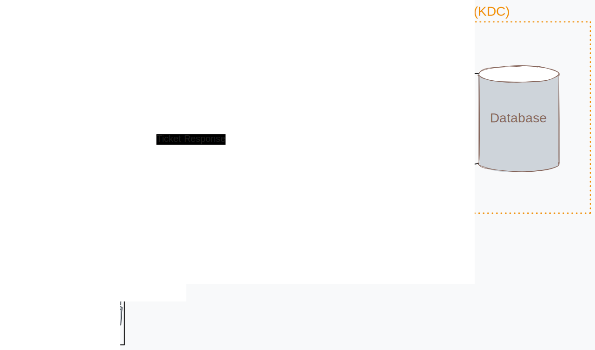
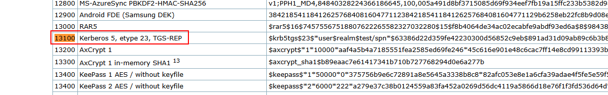
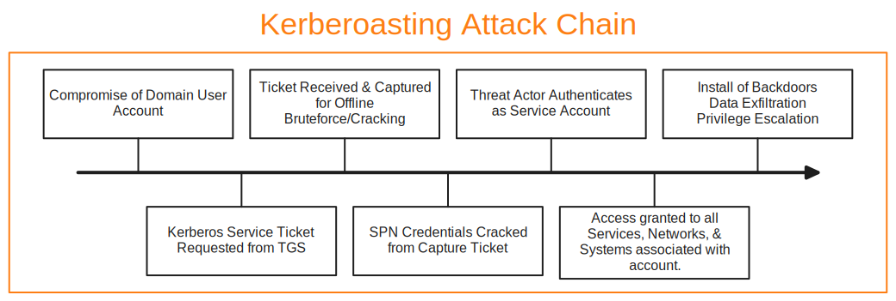

Hello Everyone! 👋

Today we will be learning about Kerberoasting, an attack that targets Kerberos. I decided to write an article about this topic as I am actively learning about the attack as a part of the Hack the Box CDSA certification.

To first understand what Kerberoasting is, we need to dive into Kerberos, what is is, what it offers, and how it works to gain better insight into how Kerberoasting are carried out, and why threat actors persistently choose this method to gain access to AD environments.
<!-- truncate -->

## Kerberos... What's that?
Kerberos is a network authentication mechanism that is used in Active Directory and other systems/environments. It was developed by Massachusetts Institute of Technology(MIT) in the last 1980's and is now the default authorization technology in Microsoft Windows, it has also been implemented in Apple OS, FreeBSD, UNIX, and Linux. Active Directory its self has the largest market share out of all IAM platforms so attackers target AD environments and attack Kerberos consistently, thus this is a good topic to learn about.  [^1] 

The main reason the protocol was developed in the first place, was to provide a way of securing authentication traffic on a given network, preventing threat actors from intercepting authentication transmissions, gaining unauthorized access. Back in the 1980's most authentication was transmitted in clear text over networks, making it easy for threat actors with network access to eavesdrop on traffic and obtain credentials.[^2]

[^1]: https://www.simplilearn.com/what-is-kerberos-article#:~:text=This%20process%20uses%20shared%20secret,against%20eavesdropping%20and%20replay%20attacks.
[^2]: https://www.techtarget.com/searchsecurity/definition/Kerberos
### Components
Kerberos consists of a few interconnected parts that work together to offer a complete & secure authentication and authorization protocol.
- **The Client**: The end point that is requesting authentication to an app, service, or network. The client will send out a request to what is called the *Key Distribution Center*, with it's encrypted credentials and await a response back.
- **Key Distribution Center**: Handles the requests from clients for authentication, is comprised of 3 elements, which all tend to reside on the same server. They are the *Authentication Server*, *Ticket Granting Server*, and a *Database*. 
	- **Authentication Server**: Component of the KDC that receives client requests and provides successfully authenticated clients with a ticket known as a *Ticket Granting Ticket (TGT)*. The TGT allows for authed clients to obtain other *Service Tickets* without having to re-enter credentials. 
	- **Ticket Granting Server (TGS)**: Component of the KDC that is the distributor of *Service Tickets* to clients with a valid *TGT*, providing them access to specific services, apps, or networks. 
	- **Database**: Part of the KDC that contains entries of *users* and the associated *services* that they have access to. Also contains information related to the *max validity duration* for a ticket, *max time a ticket may be renewed*, *password expiration date*, etc.



## Kerberoasting
Okay so now that we have an understanding of how Kerberos works, we will move on to how threat actors carry out what is called Kerberoasting. 

Kerberoasting is an attack that attempts to obtain the password hash of an Active Directory *Service Account* that has what is called a *Service Principal Name (SPN)*. What is an SPN you might ask? Well, it is a Active Directory attribute that is used by Kerberos authentication mechanisms to associate a service instance with corresponding service account, providing access to said service. [^3] [^4]
[^3]: https://www.crowdstrike.com/en-us/cybersecurity-101/cyberattacks/kerberoasting/
[^4]: https://learn.microsoft.com/en-us/windows/win32/ad/service-principal-names
### The Attack
The threat actor must first gain access to a domain user account via compromise, not a *Domain Admin account*, just a regular account, this then allows them to request a Kerberos service ticket from the TGS. This is done with the use of tools, most commonly [Rubeus](https://github.com/GhostPack/Rubeus). Once the ticket is received from the KDC the threat actor stores the key for offline brute forcing. The ticket from the KDC contains an encrypted hash of the *service accounts* password. 

Rubeus is a tool, written in C# that automates interaction and abuse of Kerberos authentication mechanisms. It has a host of options such as making Ticket Requests and Renewals, Ticket Forgery, Ticket Extraction and Harvesting. [^5] 
[^5]: https://github.com/GhostPack/Rubeus

So lets say that we wanted to use the tool to carryout our own testing, or make use of it for a capture the flag challenge. On Windows via PowerShell, the command to carry out Kerberoasting, using Rubeus, would be;
```Shell
.\Rubeus.exe kerberoast /outfile:results.txt
```

After obtaining the SPN values from Rubeus, threat actors then carry out offline brute forcing with tools like Hashcat or JohnTheRipper. In the case of hashcat, looking at the documentation for the command-line utility, there is a specific hash option designed for Kerberos 5 hashes, hash option `13100`. 
And if we were to let's say use the `result.txt` file form the Rubeus output, you could use the below command to crack the hashes of the returned SPN's.
```bash
hashcat -m 13100 -a 0 wordlist.txt results.txt --outfile="cracked-spns.txt"
```
The `-m` flag  allows for specifying what hash type we would like to crack, and as stated previously `13100` is the value for the Kerberos hash type. The`-a` flag specifies the type of attack mode to use. It's followed by the value of `0` which is "Straight Mode". Straight Mode uses a single wordlist, as you can see by flag and value having `wordlist.txt` specified after it. Next is the target file that contains the hash, in our case it is `results.txt`. At the end we have `--outfile` which directs hashcat to save the output to a specified file, in this case `cracked-spns.txt`, formatting can also be changed for the output file via `--outfile-format` as well. [^6]
[^6]: https://hashcat.net/wiki/
### Attack Chain Visualized
Below I have included a graphic of the entire Kerberoasting attack chain.



### Detection
Kerberoasting attacks can be detected via the monitoring of **Windows Event Code: 4769**, which is the Windows event code that corresponds to a Kerberos ticket being requested. In the logs for this event code there are a few fields to take not of, specifically the *Account Name*, *Service Name*, *Client Address*, and the *Ticket Encryption Type*. The value for the *Ticket Encryption Type* is an important, the hex values represent the type of encryption being used for the request and could tip us off to a potential attack. 

Below is a table of common encryption types and their strengths.

| Hex code | Encryption Type         | Description                                                                                   |
| -------- | ----------------------- | --------------------------------------------------------------------------------------------- |
| 0x17     | RC4_HMAC                | **Weak Encryption, Commonly Used for Kerberoasting attacks**                                  |
| 0x12     | AES256_CTS_HMAC_SHA1_96 | Strong encryption, preferred for modern environments.                                         |
| 0x11     | AES128_CTS_HMAC_SHA1_96 | Strong but less secure then AES256.                                                           |
| 0x01     | DES_CBC_CRC             | Deprecated/Weak encryption.                                                                   |
| 0x02     | DES_CBC_MD5             | Deprecated/Weak encryption.                                                                   |
| 0x03     | DES3_CBC_SHA1           | Stronger then both DES encryption algorithms but is not commonly used in modern environments. |

Take note that any Kerberos request that uses the `RC4_HMAC` encryption protocol is potentially an indicator of attack or compromise. 

Also, we need to note that if any of the legacy encryption methods are left enabled on the KDC server, attackers could carryout a downgrade attack on the Kerberos system, effectively forcing the authentication/authorization protocol to use a weaker level encryption allowing for threat actors to more easily crack the SPN hash. 😬

Lets say that we wanted to do an SPL query in Splunk for Kerberoasting, targeting the Event 4769 and the Ticket Encryption Value of 0x17, the query would look like this:
```SPL
index=<target-index> EventCode=4769 EncryptionType=0x17
```

### Prevention
The goal of Kerberoasting attacks is the theft of service account credentials and the eventual compromise of the AD Doman, allowing threat actors to gain a foot hold in an organizations environment and carry out further malicious actions. Due to these factors, prevention of Kerberoasting attacks should take a multi-faceted approach. Below are some methods to protect against Kerberoasting attacks:
- Use of strong & complex Service Account passwords & the updating of said passwords on a regular cadence. [^7]
- Restriction of Service Principal Name (SPN) Exposure via limiting SPN registration and using Managed Service Accounts. [^8] 
- Enforcement of strong encryption types, threat actors will attempt to push the protocol to downgrade the encryption, if these lower level encryption standards are enabled, the domain will be left vulnerable to Kerberoasting attacks. [^8]
- Implementing Monitoring and Auditing of Kerberos Ticket Requests, this will allow for alerting on unusual requests and audits will find unusual patterns that could indicate attack or compromise. [^9]

## Conclusion
And with that, you know have a pretty good understanding of Kerberos & Kerberoasting. How threat actor target Kerberos and Active Directory in an attempt to compromise a Service Account, and potentially over parts of the domain after the initial compromise. 

You also know now how to detect and defend from these types of attacks but, there is always more to learn and more to dig into and understand. As my learning progresses I will update this article with other bits of information I find related to Kerberoasting.

**Thank you for reading! 😎**

[^7]: https://www.semperis.com/blog/protecting-active-directory-from-kerberoasting/
[^8]: https://www.microsoft.com/en-us/security/blog/2024/10/11/microsofts-guidance-to-help-mitigate-kerberoasting/
[^9]: https://cymulate.com/cybersecurity-glossary/kerberoasting/