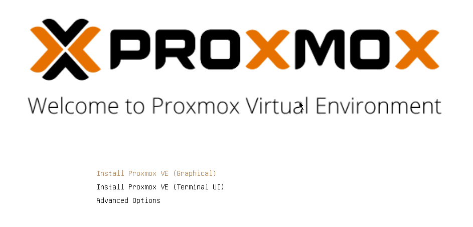
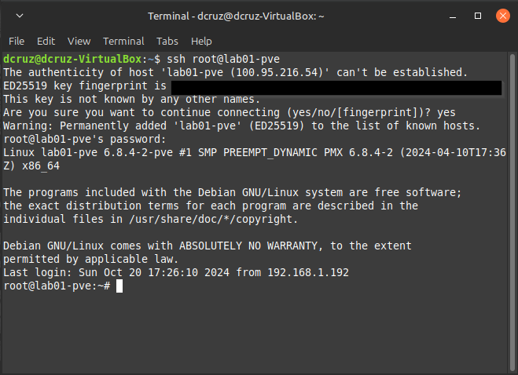
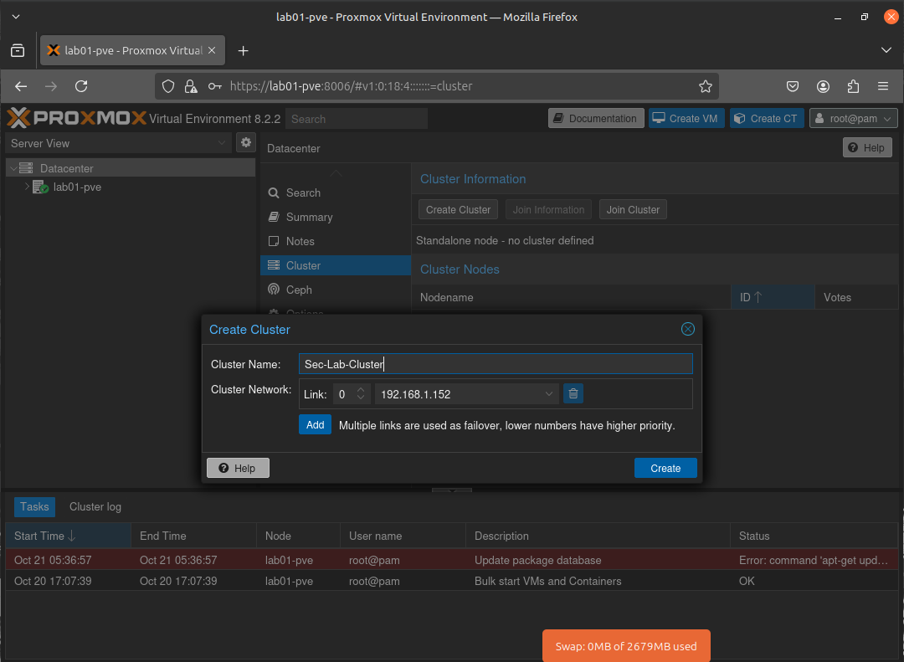
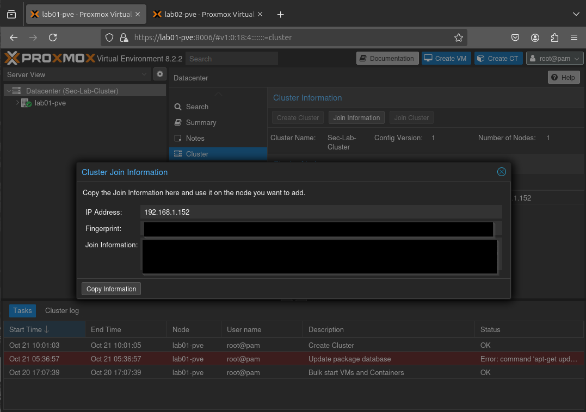
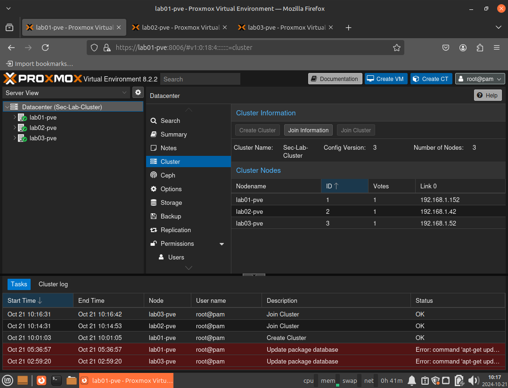

# Building The Home Lab

Hello all,

While it's been fun studying Cybersecurity concepts and tools, the time has come to put this knowledge to use with hands on projects. The goal of this lab is to have a space where I can create specific environments, providing hands-on experience with investigating threats, remediation, detection, etc.

So for this project I have gathered some hardware that I have purchased on eBay. A set of 3 Lenovo mini PC's. Two M70q Gen 3's and 1 model from a previous generation of this line of computers. I found a 3D printable 10' mini server rack and even a rack mount, specifically designed for the Lenovo mini desktops that I bought.

The plan is to install Proxmox on all 3 computers and create a Proxmox cluster so that all the nodes/computers can interface and communicate with one another via the virtual network that I will build out for the lab. I might even look at the HA (High Availability) functionality in Proxmox, which allows for failover and transfer of live VMs to the other nodes, if one of them were to go down for some reason.

## Racking

Here are the computers all racked up nice and tidy. I even installed a small patch panel to keep the ethernet cabling in order. I plan on putting a gigabit unmanaged network switch in the top rack slot.

## Zimaboard Firewall

Proxmox and other bare metal hypervisor software have the ability to carry out SDN Wan to manage a virtualized network for all logical hosts. While this a convenient implementation to have, I would like to achieve a more real world configuration via the use of the PFsense firewall OS, provided and maintained by NetGate. The hardware that I am using for the firewall is a 1st generation [[Zimaboard]].

### Installing PFSense

Installing PFSense was very straight forward, download the compressed image file, extract the image file, and image a USB flash drive via belina Etcher, or in this case, rufus. Hit F11 while the Zimaboard boots and select the flash drive as the intended boot device. Boot into the NetGate installer and configure your initial network settings. In my case, I have configured the router/firewall with these network settings:

- **Network**: `10.1.1.1/24`
- **Range Start**: `10.1.1.10`
- **Range End**: `10.1.1.100`
- **WAN Interface**: `RE0`
- **LAN Interface**: `RE1`

For now I have not configured anything else on PFSense. No ACL's or Firewall rules. The goal is to get everything up and running and communicating, and then while fleshing out projects I will enable different settings to simulate different types of network environments.

### Tenda Switch

For switching and interconnecting of physical and logical hosts, we will be using a basic 5 port Tenda switch. The switch is unmanaged and not VLAN aware, which will suit or needs for the time being.

I opted to create a simple rack mount for the switch using OnShape, a web based CAD software that's free for students and creators.

## Proxmox Install

I went ahead and installed Proxmox on all 3 computers, configuring them with hostnames and IP addressing via my routers DHCP server and also documenting the hostnames and IP addresses for later use. I also installed [Tailscale](https://tailscale.com/) which is a VPN implementation that has a host of features that make it easy to connect to your home network via mesh VPN tunnels. It uses Wireguard under the hood to accomplish this, allowing me to access the lab from my personal computer, while I am on the guest WIFI network while I am at work. Below are all the node details, after network config and Tailscale install.

| Hostname        | IP Address    | Tailnet Address |
| --------------- | ------------- | --------------- |
| lab01-pve.local | 192.168.1.152 | 100.95.216.54   |
| lab02-pve.local | 192.168.1.42  | 100.64.68.17    |
| lab03-pve.local | 192.168.1.52  | 100.65.41.127   |

Great thing about Tailscale is the Magic DNS functionality which allows me to connect to the nodes via there hostname anywhere. So even if I am off-site, I can connect to tailscale and ssh or load the web interface of Proxmox via the hostname.

## Proxmox Config & Clustering

Now for the fun part, getting all of these nodes into a cluster. Looking at the Proxmox [documentation](https://pve.proxmox.com/pve-docs/pve-admin-guide.html#chapter_pvecm) the only requirement is that the nodes be running Proxmox and have their final hostname & IP address configurations. In the Proxmox GUI we need to navigate to `Datacenter>Cluster`.

I gave the cluster super original name of `Sec-Lab-Cluster`😜, and proceeded on to the next step.

Okay so the cluster has been created. Not it's time to add the other nodes to the Proxmox Cluster and get them talking to one another and sharing resources. For that, we need to login to each other the other two clusters and join them to the cluster established on **Lab01-pve** but, first there is some info that we need handy. We need to login to **Lab01-pve** and get the cluster info to add to the other nodes. So, to do this we go to `Datacenter>Cluster>Join Information`.

Then on the joining node we go to `Datacater>Cluster>Join Cluster` and paste in the information. Pasting the info we copied from **Lab01-pve** brings up all the required info for joining the node, minus the root password. We input that and then join the node to the cluster. I did this again on the last and final node and here is the result:

All 3 nodes in a single cluster. 😎

## So What's Next?

That's a good question. So my plan is to follow all the the domains of the Security+ and also the SC-300 from Microsoft, both of which are certifications that I currently hold. Applying the learning I have done to hands on projects. I am specifically excited to tackle a PKI project as the topic interested me while I was studying for the Security+ SY0-701. 