# Building a CyberSecurity Home Lab

Hello all, 

While it's been fun studying Cybersecurity concepts and tools, the time has come to put this knowledge to use with hands on projects. The goal of this lab is to have a space where I can create specific environments, providing hands-on experience with investigating threats, remediation, detection, etc.

So for this project I have gathered some hardware that I have purchased on eBay. A set of 3 Lenovo mini PC's. Two M70q Gen 3's and 1 model from a previous generation of this line of computers. I found a 3D printable [10' mini server rack](https://www.printables.com/model/427461-10-inch-server-rack) and even a [rack mount](https://www.printables.com/model/202118-lenovo-tiny-10-inch-rack-mount), specifically designed for the Lenovo mini desktops that I bought. Shout out to the respective creators of these. 👏

The plan is to install Proxmox on all 3 computers and create a Proxmox cluster so that all the nodes/computers can interface and communicate with one another via the virtual network that I will build out for the lab. I might even look at the HA (High Availability) functionality in Proxmox, which allows for failover and transfer of live VMs to the other nodes, if one of them were to go down for some reason.

Here are the computers all racked up nice and tidy. In the top slot will go some additional hardware which I will detail later on in this post.
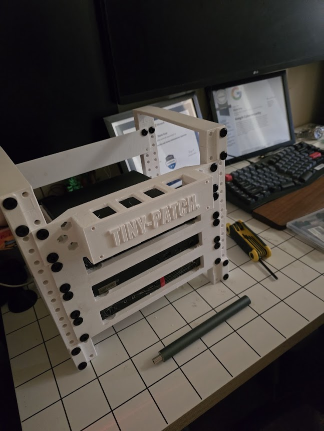

## Zimaboard Firewall

The first addition to the top rack slot will be a Zimaboard. Why a Zimaboard you ask? Proxmox and other bare metal hypervisors have the ability to carry out Software Defined networking to manage a virtualized network for all logical hosts. While this a convenient implementation to have, I would like to achieve a more real world configuration via the use of a hardware-based PFSense firewall, PFSense is a router/firewall operating system based on FreeBSD and maintained by the NetGate company. The OS has a host of features including VLANs, NAT, Port Forwarding, ACLs, QoS, etc, which should be everything I need. 

The [Zimaboard](https://shop.zimaboard.com/), which conveniently has two ethernet ports on the front, and has enough horsepower for out routing/firewall needs will be the host for the PFSense OS. I needed to find a way to mount the device in the rack. Looking through [Printables](https://printables.com/) again, I found a model created by user [@MartinRowan](https://www.printables.com/@MartinRowan) for mounting the Zimaboard to a rack.
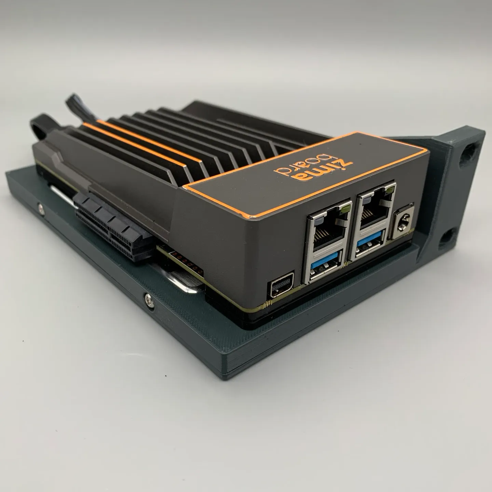

### Installing PFSense

Installing PFSense was very straight forward, download the compressed image file, extract the image file, and image a USB flash drive via Belina Etcher, or in this case, rufus. Hit F11 while the Zimaboard boots and select the flash drive as the intended boot device. Boot into the NetGate installer and configure your initial network settings. In my case, I have configured the router/firewall with these network settings:

- **Network**: `10.1.1.1/24`
- **Range Start**: `10.1.1.10`
- **Range End**: `10.1.1.100`
- **WAN Interface**: `RE0`
- **LAN Interface**: `RE1`

For now I have not configured anything else on PFSense. No ACL's or Firewall rules. The goal is to get everything up and running and communicating, and then while fleshing out projects I will enable different settings to simulate different types of network environments.

#### Network Topology

Here is a breakdown of the Network Topology as it's been configure at the current moment.

*Right-Click open in a new tab to see the image larger.*
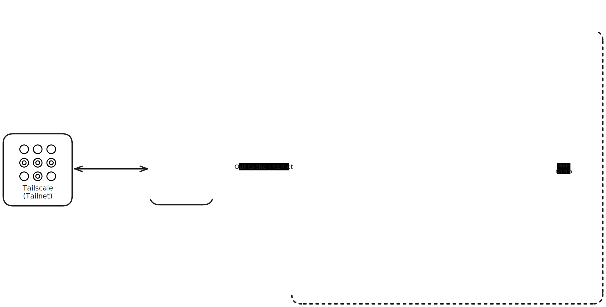
  
### Tenda Switch
  
For switching and interconnecting of physical and logical hosts, we will be using a basic 5 port Tenda switch. The switch is unmanaged and not VLAN aware, which will suit or needs for the time being. 
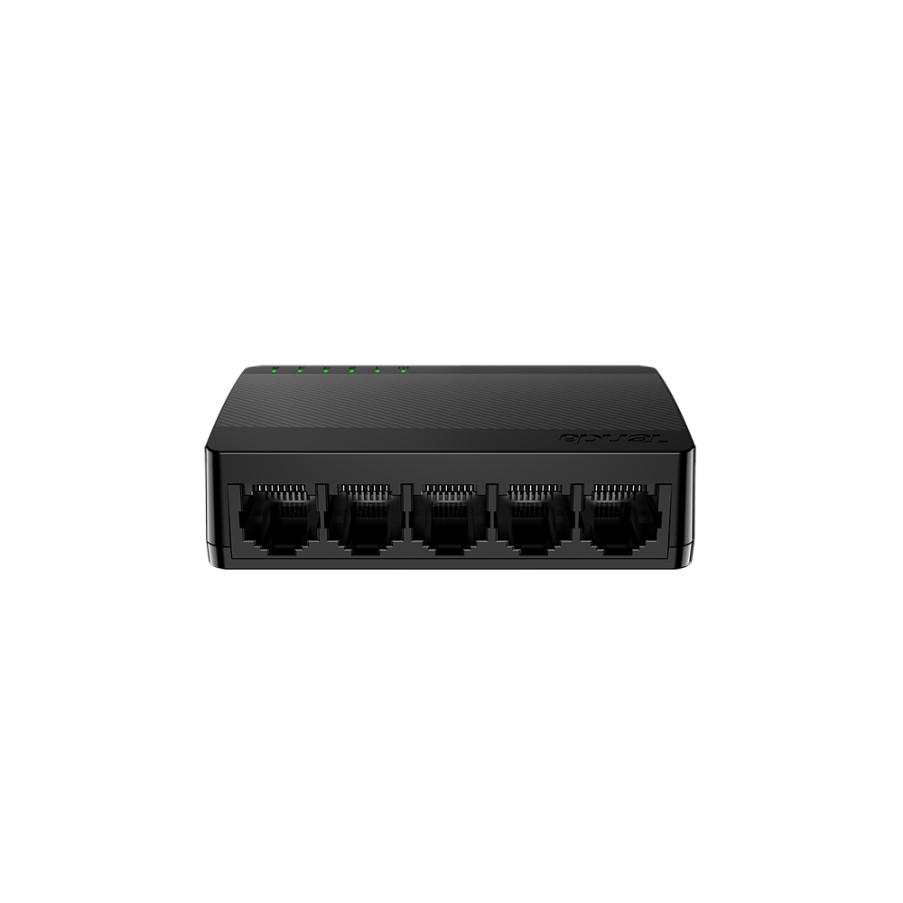
  
#### Rack Mount
  
I opted to create a simple rack mount for the switch using OnShape, a web based CAD software that's free for students and creators. I took measurements of the switch and noted where the ports where and the power terminal so that everything was accessible.
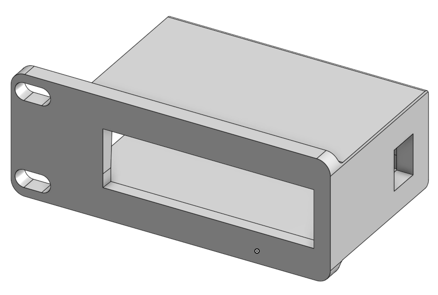
Here is the final product, if you ever find your self in need of a rack mount for this specific model of switch you can find that model [here] for download.

Also, here is the completed rack with the Tenda switch and Zimaboard installed. 😁
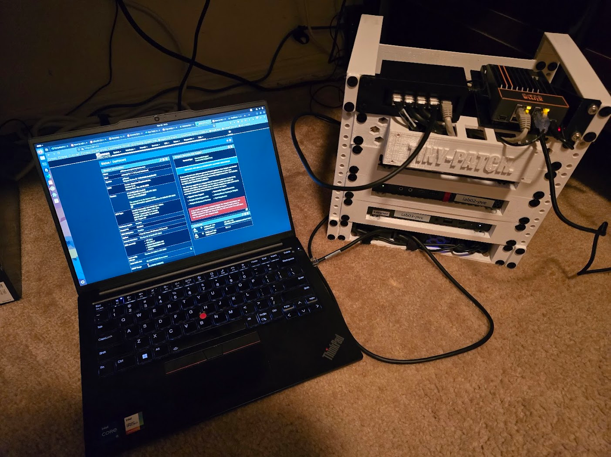

## Proxmox Install

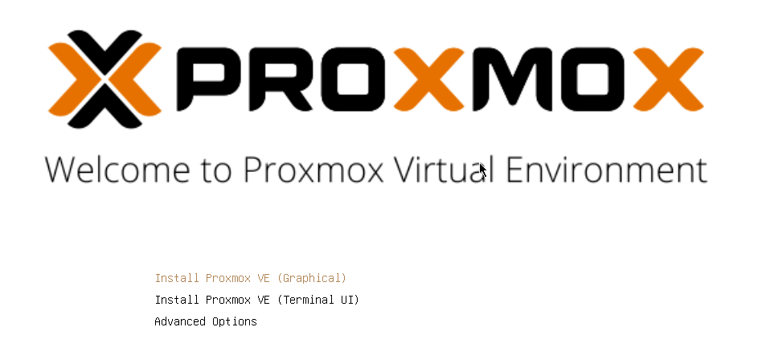
I went ahead and installed Proxmox on all 3 computers, configuring them with static IP addresses, documenting them as I go. Configured the root/admin password on all hosts had then boot up to the login screen. By default Proxmox has ssh running so, now that all the hypervisor hosts are on the network, I can remote into them via the terminal.

## Tailscale

Tailscale is my solution for remote access to the lab. It's a VPN implementation that has a host of features that make it easy to connect to your home network via mesh VPN tunnels. It uses Wireguard under the hood to accomplish this, allowing me to access the lab from my personal computer, while I am on another network. Below are all the node details, after network config and Tailscale install. I also installed Tailscale on my PFSense host as well.  

| Hostname            | IP Address | Tailnet Address |
| ------------------- | ---------- | --------------- |
| lab01.local         | 10.1.1.11  | 100.90.166.52   |
| lab02.local         | 10..1.1.12 | 100.123.54.72   |
| lab03.local         | 10.1.1.13  | 100.125.134.1   |
| pfsense-pve-gateway | 10.1.1.1   | 100.65.75.85    |

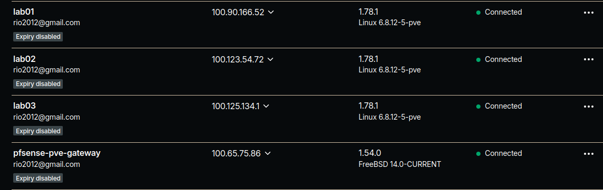
Great thing about Tailscale is the Magic DNS functionality which allows me to connect to the nodes via there hostname anywhere. So even if I am off-site, I can connect to tailscale and ssh or load the web interface of Proxmox via the hostname.
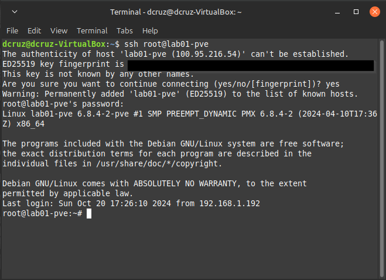

## Proxmox Config & Clustering

Now for the fun part, getting all of these nodes into a cluster. Looking at the Proxmox [documentation](https://pve.proxmox.com/pve-docs/pve-admin-guide.html#chapter_pvecm) the only requirement is that the nodes be running Proxmox and have their final hostname & IP address configurations. In the Proxmox GUI we need to navigate to `Datacenter>Cluster`.
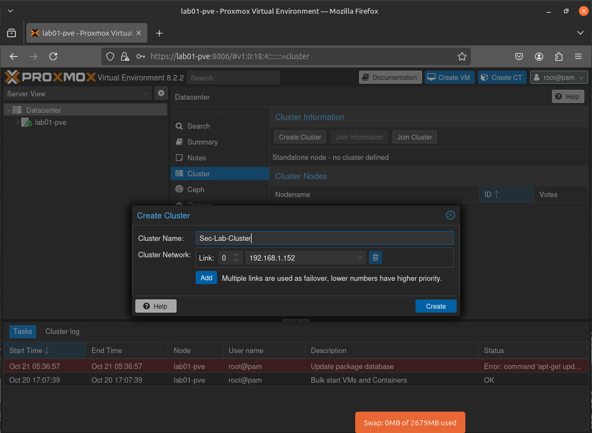

I gave the cluster super original name of `Sec-Lab-Cluster`😜, and proceeded on to the next step.

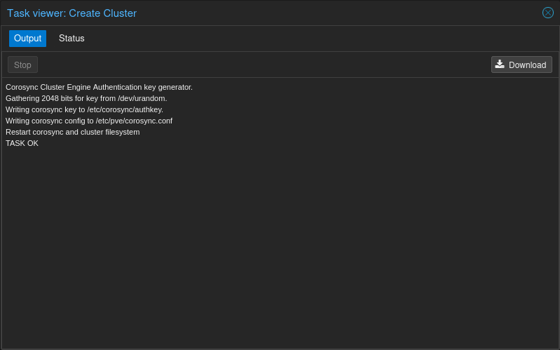

Okay so the cluster has been created. Not it's time to add the other nodes to the Proxmox Cluster and get them talking to one another and sharing resources. For that, we need to login to each other the other two clusters and join them to the cluster established on **Lab01-pve** but, first there is some info that we need handy. We need to login to **Lab01-pve** and get the cluster info to add to the other nodes. So, to do this we go to `Datacenter>Cluster>Join Information`.
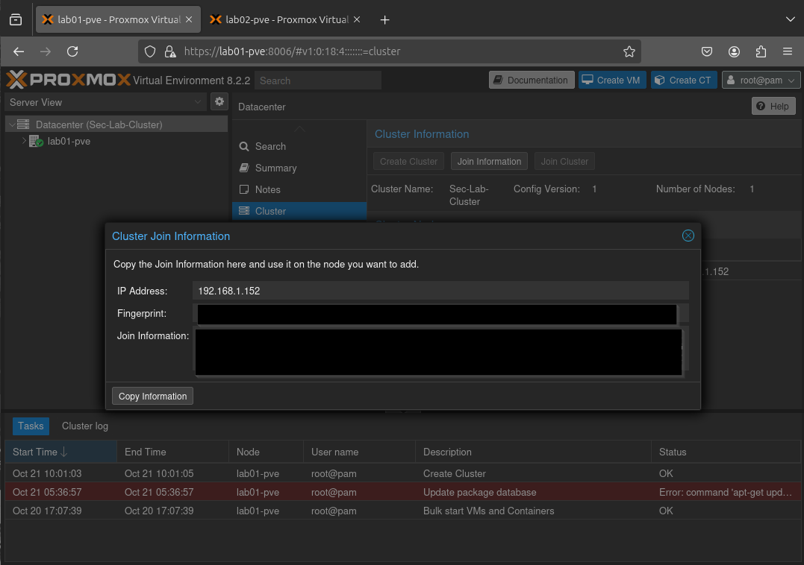

Then on the joining node we go to `Datacater>Cluster>Join Cluster` and paste in the information. Pasting the info we copied from **Lab01-pve** brings up all the required info for joining the node, minus the root password. We input that and then join the node to the cluster. I did this again on the last and final node and here is the result:

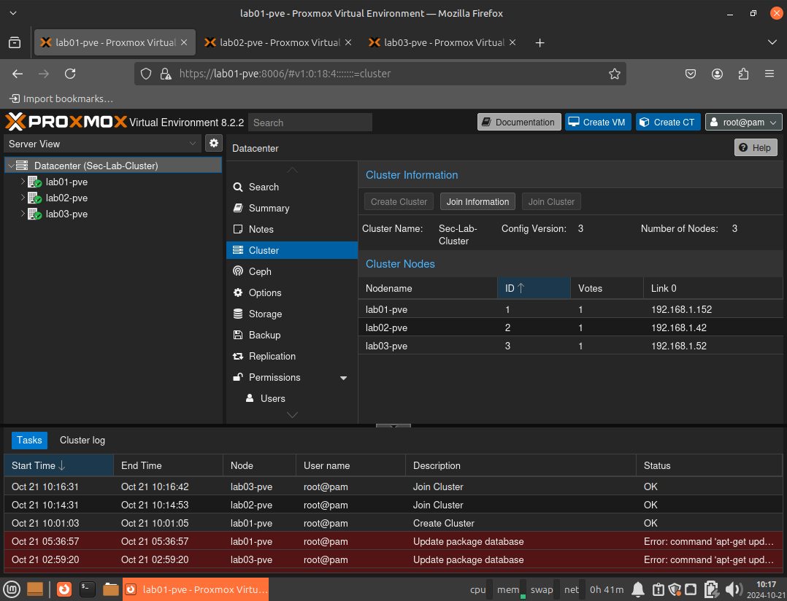
All 3 nodes in a single cluster. 😎

## So What's Next?

That's a good question. So my plan is to follow all the the domains of the Security+ and also the SC-300 from Microsoft, both of which are certifications that I currently hold. Applying the learning I have done to hands on projects. I am specifically excited to tackle a PKI project as the topic interested me while I was studying for the Security+ SY0-701. *Update December 2024: Security+ Certification has been obtained.*

### Active Directory Labs

Since starting my learning for the Hack The Box CDSA, I have completed the module, Windows Attack & Defense which hosts a large amount of information about attacks that target Active Directory.

### Qualys Vulnerability Management

At my current organization, we are implementing Qualys for endpoint vulnerability management. So., it would make sense to learn the platform and how to deploy scanning on end-points.
