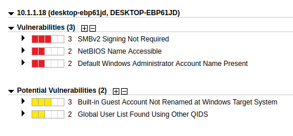
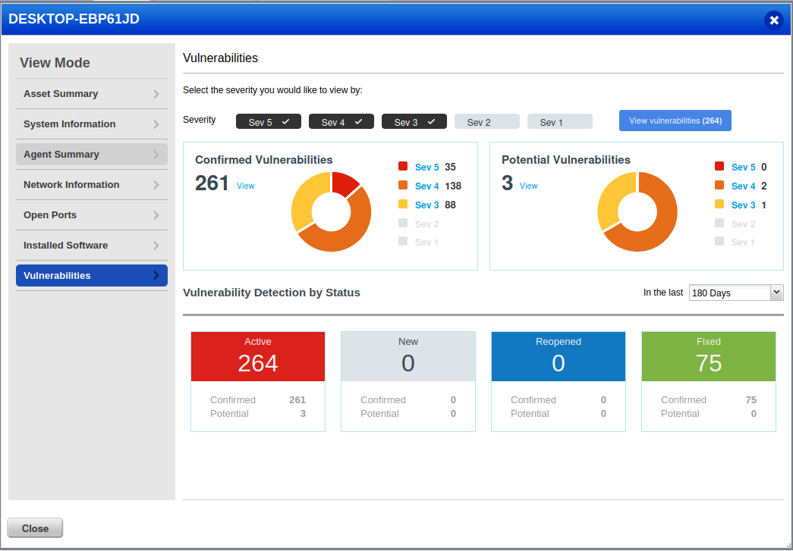
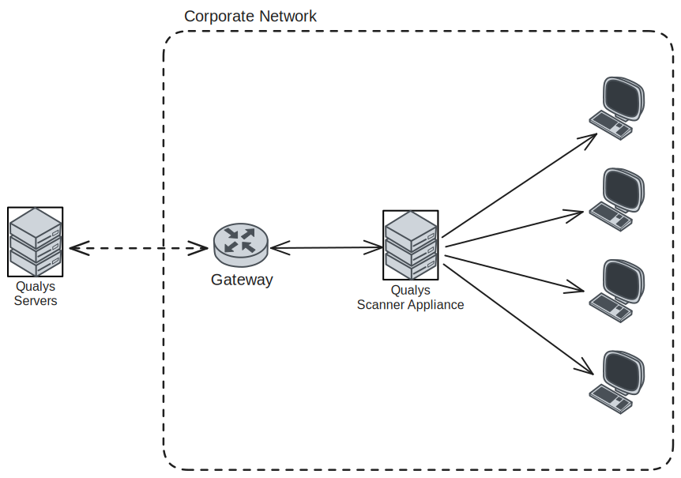
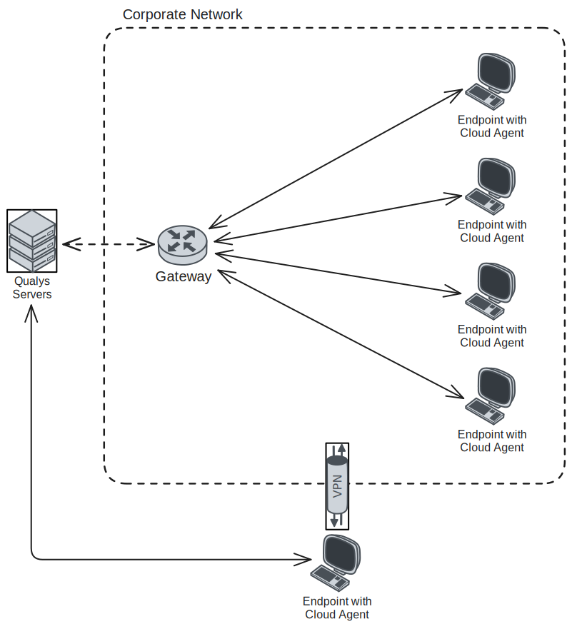

We now have two sets of vulnerability reports for our Windows 10 machine. Both sets of reports were conducted from different vantage points on the same machine. The Qualys scanner appliance completed an *external* scan though it was credentialed. Our Qualys cloud agent was setup to run as a service on the Windows 10 machine and completed scans with *direct access*. Lets analyze both reports to see how they differ.

## Comparing Vulnerability Reports

From the previous entries in this project, we should remember that the scanner appliance only found 5 vulnerabilities, 3 of which are confirmed vulnerabilities 2 potential. Most of the vulnerabilities found where related to configurations of operating system services.

Now, looking at the Qualys cloud agent scan, we can see that this scan in particular found many more vulnerabilities on the same system, 264 in total. 

The cloud agent as you can see provides more in depth scanning and detail in regards to the vulnerabilities that where found but, why is this?

## Scanning from Two Different Vantage Points

The Qualys scanner appliance and the cloud agent provide scanning from different vantage points and ways of implementing scanning. The Qualys scanner appliance resides on the network, external to the target machine(s). The advantage it has is the ability to scan multiple targets and do so either on demand or on a schedule. All and administrator needs to do is ingest the machines into the Qualys platform and provide admin credentials. Once the scanner appliance is on the network it will start reporting on it's findings, without the need to install software on the endpoint. 

Qualys cloud agent runs it's scans while residing on the endpoint, running as an elevated service. Since it resides on the endpoint machine, it has the ability and the access to complete deeper more detailed scans of the target endpoint, analyzing applications installed/running, system configurations, and more. One advantage to note with cloud agents is that they are not dependent on the endpoint being on the corporate network. It's common now in enterprise environments to have sets of users that work remote but, still need to be monitored for compliance and vulnerabilities, Qualys cloud agents facilitate this functionality. 

