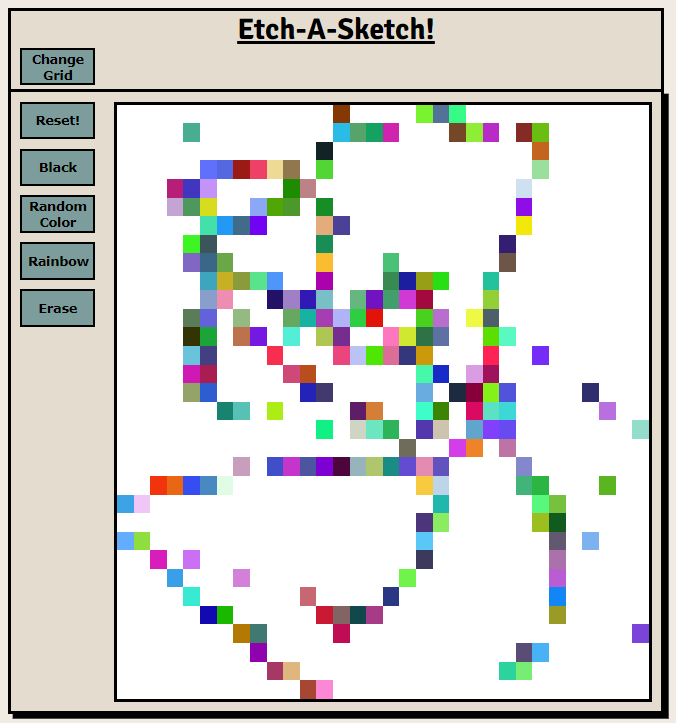

# Etch-A-Sketch

JavaScript Etch-A-Sketch web app. The goal of which was to use JavaScript to created the logic to allow the user to select which color they want to "sketch with, allow them to erase their work if needed, and to impliment a rainbox mode to keep things interesting. 😉




#Links

---

**Github Repo:** [EtchASketch Repo](https://github.com/dario-cruz/Etch-A-Sketch)
**Live App:** [EtchASketch Live App](https://dario-cruz.github.io/Etch-A-Sketch/)

---

## Features
- 3x Grid sizes. 64x64. 128x128, and 256x256
- Single color function.
- Rainbow color function.
- Eraser function. 
- Canvas Reset. 

## Psuedocode

```
On Game start:
    Set grid to default (64x64):
        Create div objects in grid container relative to grid size option.
        Set div objects to default color (white).
    Set color to default (black)

Function (Coloring) {
    On Mouse Over:
        Set grid element to color.(based on user selected option.)
}

Function (Erasing) {
    One Mouse Over event:
        Set grid element to white.
}

Function(Reset) {
    On button press / selection:
        Set all grid elements to color (white)
}

```